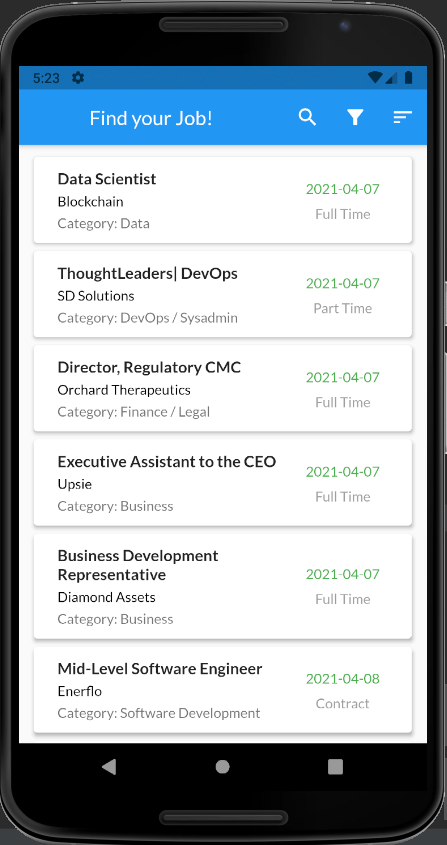
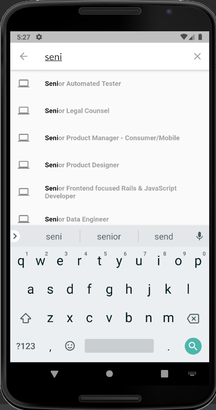
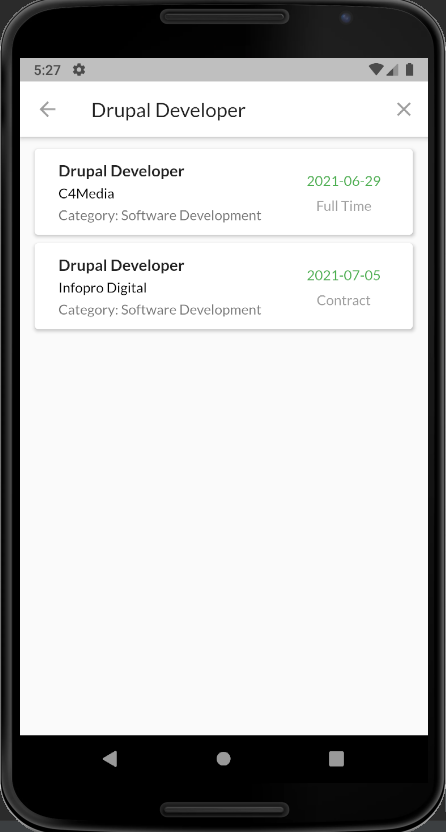
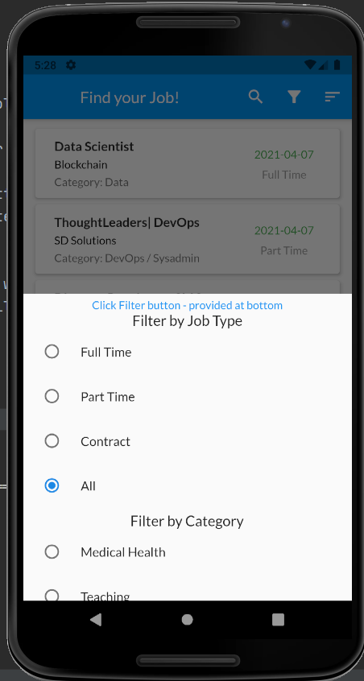
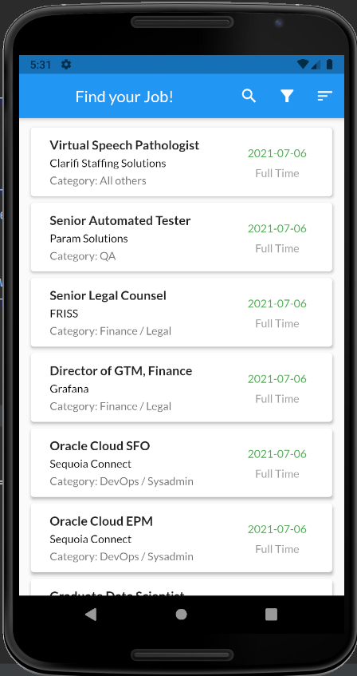
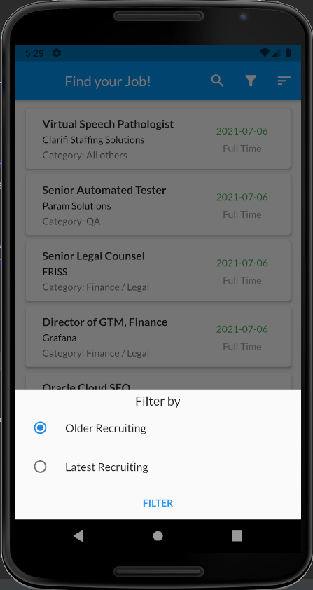

# find_jobs

A Flutter Project to Find Jobs. The job information is fetched from API and displayed on Dashboard.

You can find detail information of job by clicking on Card.
 

Also on clicking the url, you will be redirected to webpage.

You can also search job according to title/role.
 

You can filter jobs according to Job Type or/and category of job.

and results of filter applied are:
 

You can sort jobs depending on published date.

