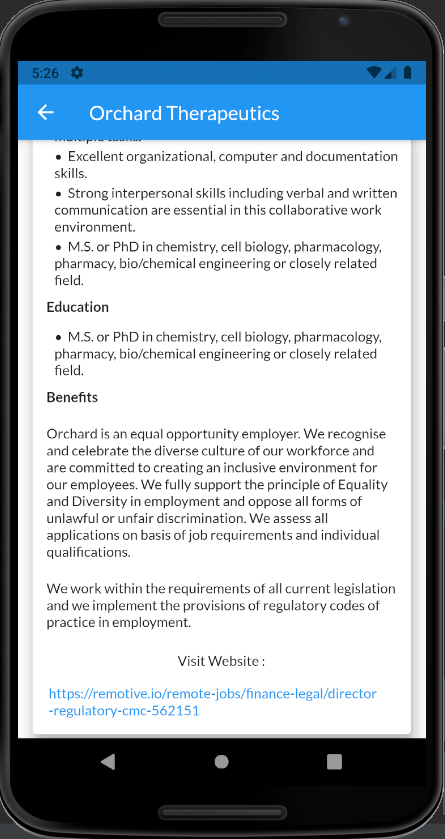

# find_jobs

<h3>A Flutter Project to Find Jobs. The job information is fetched from API and displayed on Dashboard.<h3> 

 
<h3>You can find detail information of job by clicking on Card.<h3> 
 
 
<h3>Also on clicking the url, you will be redirected to webpage.<h3> 

 
<h3>You can also search job according to title/role.<h3> 
 
 
<h3>You can filter jobs according to Job Type or/and category of job.<h3> 

<h3>and results of filter applied are:<h3> 
 
 
<h3>You can sort jobs depending on published date.<h3> 

 
